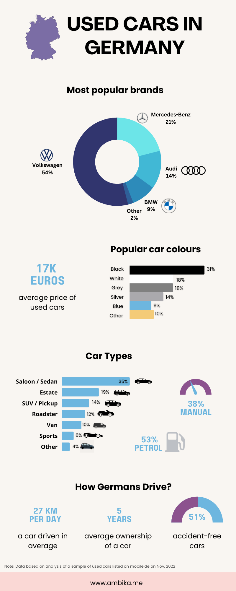

# Analysis of used cars sales in Germany

An analysis of used cars in Germany.

 

## Data source

I have scraped a sample of used cars from the website [mobile.de](https://mobile.de) - one of the largest online portal for used cars in Germany.

## Tools used:

1. Python
2. Pandas
3. Canva [to create the image]

## Source code

Find the notebook at [notebooks/analysis_for_infographics.ipynb](notebooks/analysis_for_infographics.ipynb)
